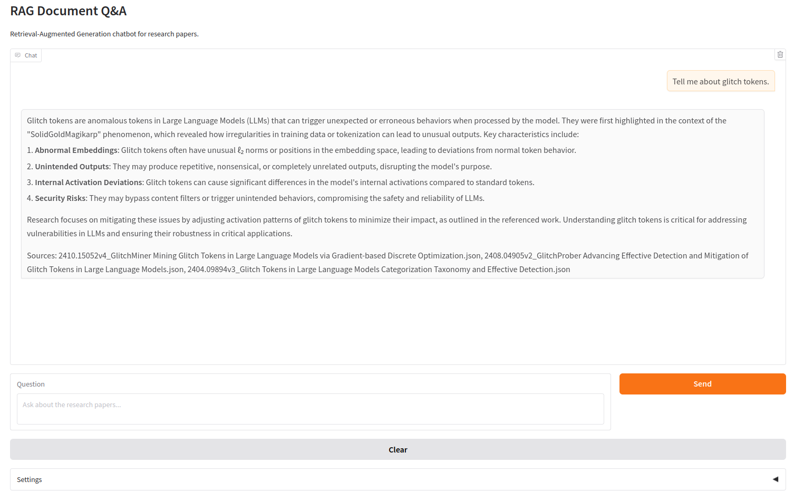

# RAG Document Q&A with arXiv Papers

Retrieval-Augmented Generation chatbot for research papers using LangChain, Milvus, and Gradio

### Features

* 📥 Download arXiv papers by search terms
* 🧠 Parse PDFs into structured document format
* 🔍 Chunk and embed content into Milvus vector DB
* 💬 Gradio chat interface with Qwen-1.7B LLM
* 🔗 Source citations for answers

## Configuration

Edit SEARCH_TERMS in 0_download_arxiv_pdfs.py to change paper topics
Modify LLM_MODEL in 3_gradio_app.py to use different language models
